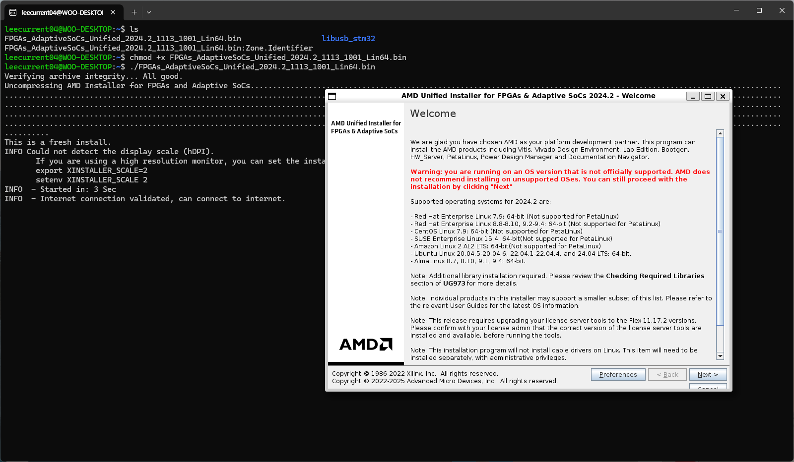
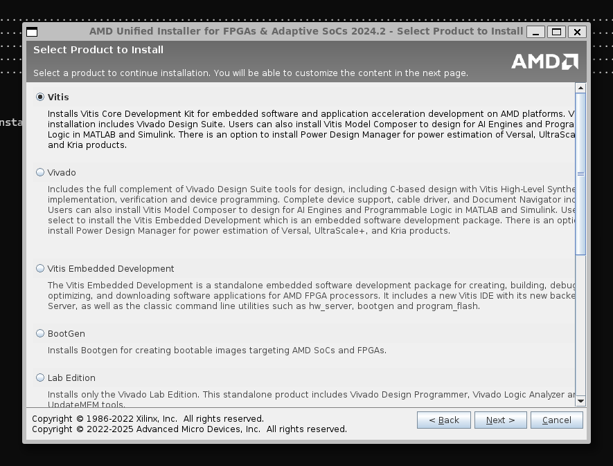
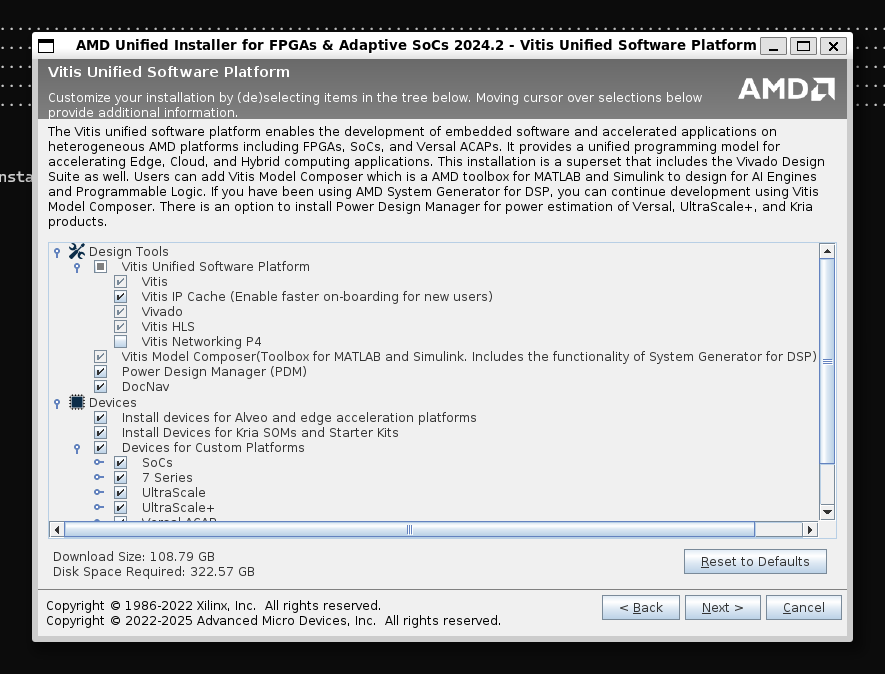
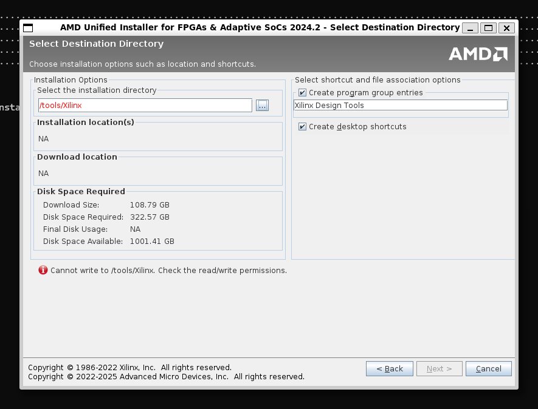
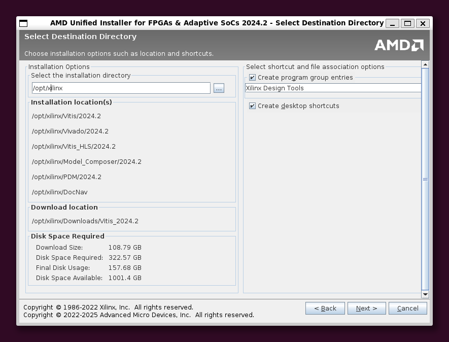
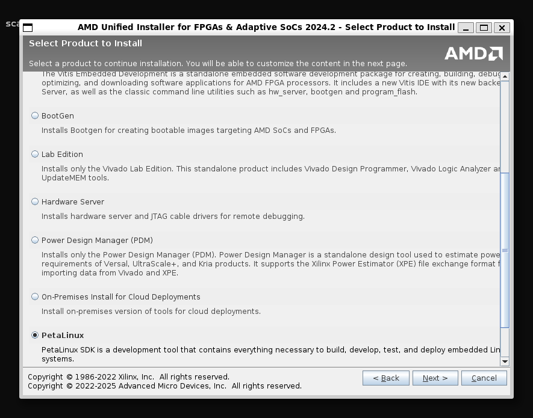
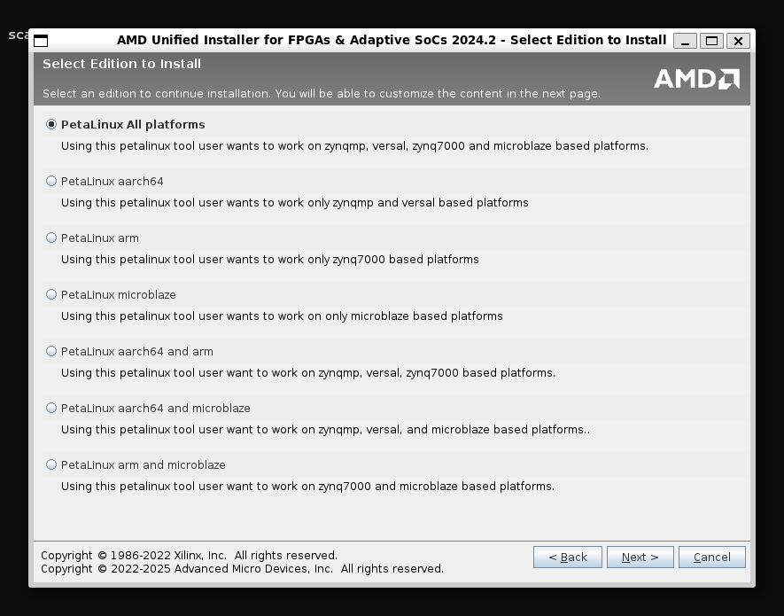

# 0. Vivado & PetaLinux Build 환경 구축

설치 할 것
- Vitis (설치시 Vivado도 설치됨)
- PetaLinux Build 환경

PetaLinux를 빌드하기 위해서 Ubuntu 환경이 필요하다. 네이티브 환경을 권장하지만, 본 글에서는 WSL2 (Ubuntu 22.04 LTS)로 진행하였다.


## 1. Vivado

AMD Vivado 홈페이지에 접속하여 계정을 생성하고, 설치 파일을 다운 받는다.

### 1. installer 실행



만약 파일의 실행 권한이 없다면 아래 명령으로 실행 권한을 추가한다.

```bash
chmod +x ./[파일 이름]      # 실행 권한(x) 추가
./[파일 이름]               # 파일 실행
```

### 2. Vitis 선택



**Vitis**로 설치한다.



필요한 패키지를 추가 선택하고 설치한다.


### 3. 설치 경로



*Cannot write to /tools/xilinx. Check the read/write permissions* : 설치 경로에 대한 RW 권한이 없음.

아래 명령을 통해 `/opt` 아래 새로운 폴더를 만들고 소유자를 `$USER`로 변경한다.

```bash
sudo mkdir /opt/xilinx
sudo chown $USER /opt/xilinx
```



설치가 완료되면 다음 명령을 통해 필요한 라이브러리를 다운 받고, 환경 변수를 로드한다.

```bash
sudo ./opt/xilinx/Vitis/2024.2/scripts/installLibs.sh
source ./opt/xilinx/Vivado/2024.2/settings64.sh
```


## 2. PetaLinux Build 환경

Vitis 설치때 사용한 installer 파일을 다시 실행한다.

### 1. installer 실행

아래로 내려서 PetaLinux를 선택하고, 타켓 프로세서를 선택한다.




Vitis와 동일하게 경로를 설정한다.

GUI에서 설치가 끝나면, 최종적으로 실행할 바이너리 파일을 설치해야 한다. <br>
아래 명령을 통해 바이너리 파일이 설치될 경로를 생성한다.

```bash
sudo mkdir -p /opt/pkg/petalinux
sudo chown $USER:$USER /opt/pkg/petalinux/
```

다음 명령을 통해 바이너리 파일을 설치한다.

```bash
/opt/xilinx/PetaLinux/2024.2/bin/petalinux-v2024.2-final-installer.run -d /opt/pkg/petalinux/
```

만약 다음과 같은 오류가 발생하는 경우, 필요한 패키지와 라이브러리를 설치한다.

```bash
$ /opt/xilinx/PetaLinux/2024.2/bin/petalinux-v2024.2-final-installer.run -d /opt/pkg/petalinux/
PetaLinux CMD tools installer version 2024.2
============================================
[WARNING] This is not a supported OS
[INFO] Checking free disk space
[INFO] Checking installed tools
[ERROR] You are missing the following system tools required by PetaLinux:

 - xterm
 - autoconf
 - libtool
 - texinfo
Please check PetaLinux installation guide - required tools and libraries package section for detailed information

[INFO] Checking installed development libraries
[ERROR] You are missing these development libraries required by PetaLinux:

 - ncurses

Please install them with your operating system package manager, and try again
ERROR: Please install required packages.

$ sudo apt install ncurses-base xterm autoconf libtool texinfo libncurses5-dev
```

필요한 패키지를 설치하고 다시 실행하면 설치가 진행된다.

